# FM-ADC PCG/ECG PCB Prototypes

**PCB layout, fabrication, assembly, and testing | UC San Diego**

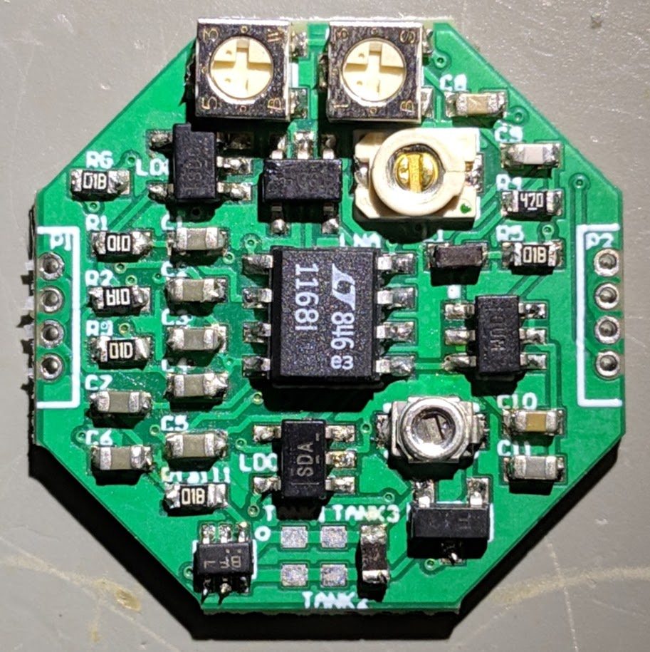

*Assembled PCG PCB (Rev 3).*

I worked on phonocardiogram (PCG) and electrocardiogram (ECG) sensing prototypes as part of an electrical engineering research project. My work focused on PCB layout, fabrication preparation, assembly, testing, and hardware revisions.

## PCB Layout and Design

I created the PCG and ECG PCB layouts in Altium Designer using the research group's existing circuit schematics, placing components and routing traces from blank board layouts.

The later PCG layout shown below uses a **22 mm x 22 mm, two-layer octagonal PCB**. I placed the PCG sensor on the bottom side so it could contact the body directly, with most of the supporting components on the top side.

| PCG PCB - top layout | PCG PCB - bottom layout |
| :---: | :---: |
| 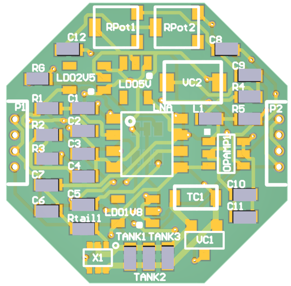 | 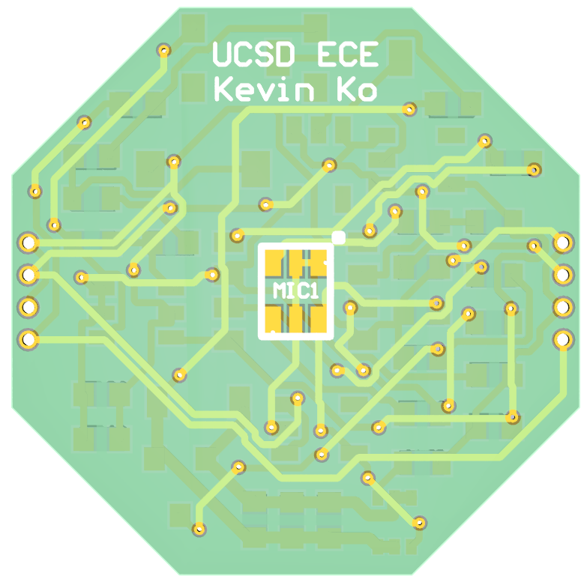 |

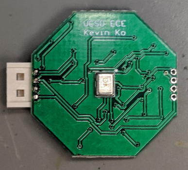

*Underside of the PCG PCB, showing the body-facing sensor.*

### ECG PCB Layout

| ECG PCB - top layout | ECG PCB - bottom layout |
| :---: | :---: |
| 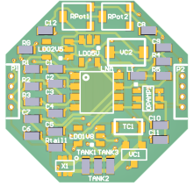 | 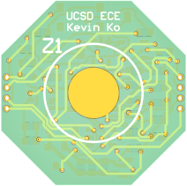 |

## Circuit Overview

The PCG prototype used a bone-conduction sensor to pick up heart sounds. Its signal passed through a low-noise amplifier and then to a voltage-controlled oscillator (VCO), which represented changes in signal voltage as changes in frequency. The underlying FM-ADC research architecture supported frequency-division multiplexing (FDM) of sensor channels.

## Fabrication and Assembly

I generated Gerber files for fabrication and sent the board designs to an external PCB manufacturer. I assembled the prototypes with a microscope and tweezers, including soldering 0402 components.

| Fabricated PCB | Microscope soldering setup |
| :---: | :---: |
| 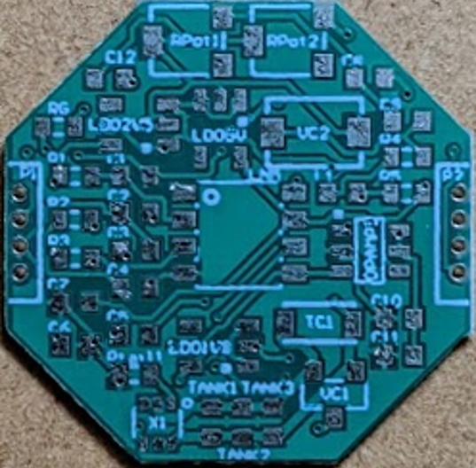 | 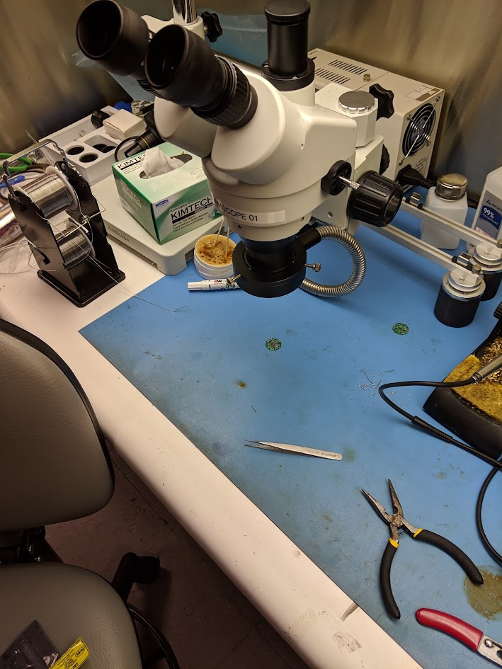 |

When specified parts were unavailable or obsolete, I selected replacements by comparing datasheets for electrical specifications, package compatibility, and availability.

## Bench Testing and Revisions

I tested the assembled prototypes using an adjustable DC bench power supply, oscilloscope, and multimeter. I checked circuit behavior and investigated noise observed during testing.

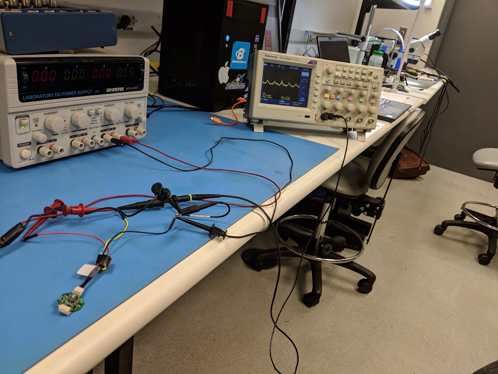

| Revision 2 | Revision 3 | Revision 4 |
| :---: | :---: | :---: |
| 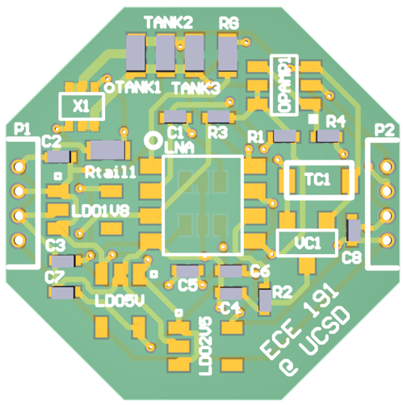 | 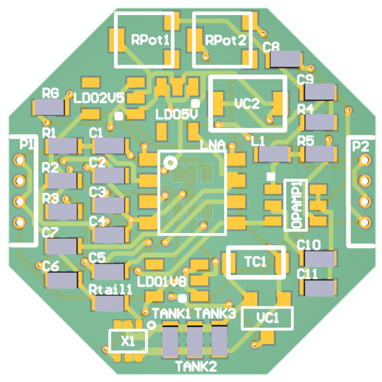 | 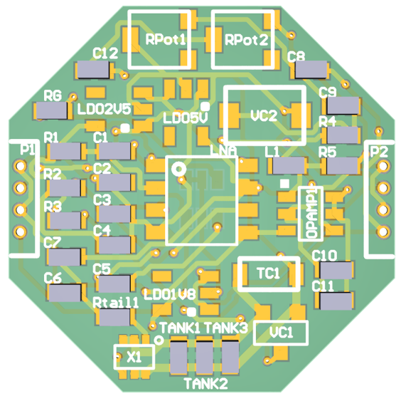 |

- **Rev 2:** An earlier prototype used in testing.
- **Rev 3:** A bandpass stage was added after noise was observed during testing.
- **Rev 4:** A 2.2 µF series capacitor was added between the bandpass output and the VCO input.

The circuit changes were developed collaboratively within the research group. Once the changes were decided, I updated the PCB layouts, assembled the revised boards, and tested them.

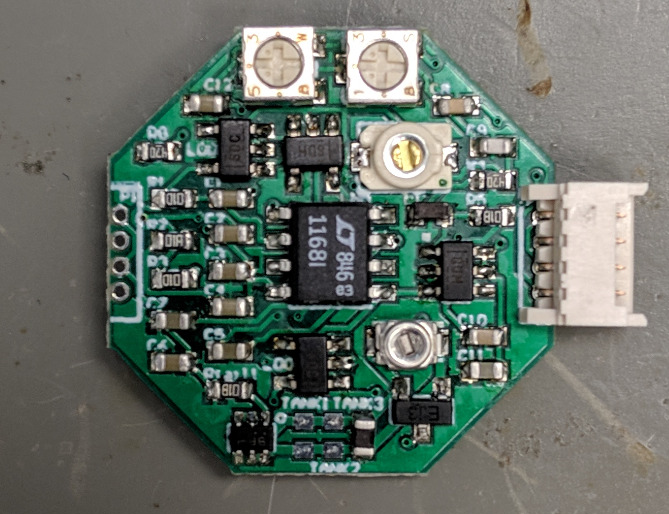

*Later assembled PCG prototype with its connector installed.*

## PCG Signal Recovery

I worked with the supervising PhD student on PCG signal acquisition and demodulation using a DAQ and MATLAB. I generated the spectrum and recovered-waveform plots shown below, as well as the audio file. The audio contains my own recorded heart sounds.

| High-frequency signal spectrum | Recovered PCG waveform |
| :---: | :---: |
| 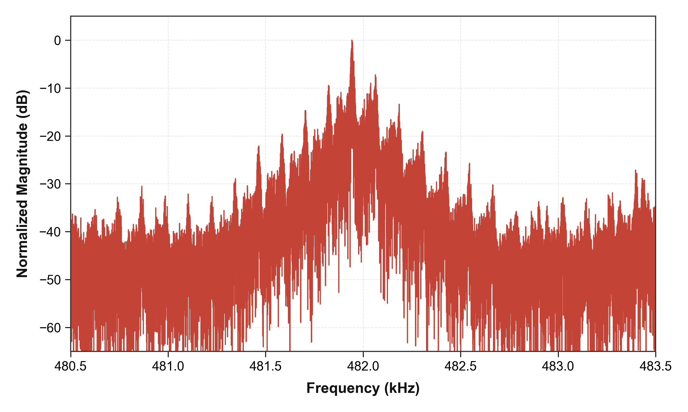 | 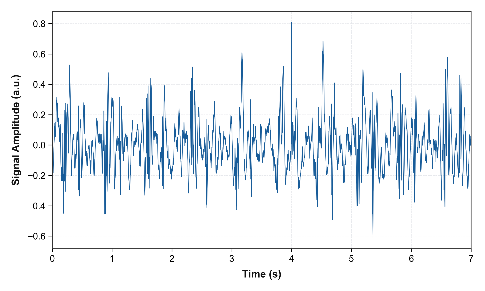 |

[Recovered heart-sound audio (.wav)](audio/pcg-recovered-heart-sound.wav)
